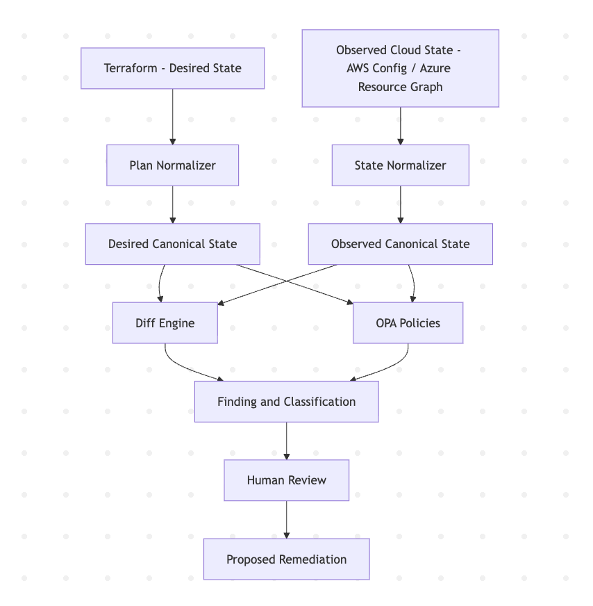

# Sentinel-IaC

Sentinel-IaC is a policy-as-code and drift-detection project for cloud infrastructure.

Terraform represents the intended state of the infrastructure. Cloud observations are normalized into the same canonical format, compared with the intended state, and checked against OPA policies. The goal is to make the same governance rules usable against both planned infrastructure and observed cloud state.

The project started with an AWS-focused design and was later extended with an Azure `student-demo` environment so that part of the workflow could be tested against a real cloud deployment.

## Architecture




## Why this exists

Infrastructure can change after the original Terraform deployment. A security rule can be changed manually, a resource can drift from its intended configuration, or the observed cloud state can differ from what the repository says should exist.

This project explores a simple question: can desired state and observed state be converted into one common representation and checked using the same policy rules?

The implementation uses a canonical state model, a diff engine, OPA policies, and human-reviewed remediation rather than automatically changing infrastructure.

The reasoning behind the canonical schema is documented in `docs/decisions/0007-normalized-canonical-schema.md`.

## Verification

The current repository has been validated with:

- **Python:** 37/37 tests passing
- **OPA:** 48/48 policy tests passing with OPA 0.68.0
- **Terraform:** all 3 Terraform configurations initialize and validate successfully
- **Azure:** the `student-demo` environment was deployed and tested on a real Azure subscription, then destroyed

The GitHub Actions validation workflow does not require AWS or Azure credentials.

## Quick start

The repository can be validated without AWS or Azure credentials.

Create a virtual environment and install the Python dependencies:

```bash
python3 -m venv .venv
source .venv/bin/activate
python -m pip install -r drift/detector/requirements.txt
python -m pip install -r scripts/requirements.txt
python -m pip install pytest
```

Run the Python tests:

```bash
python -m pytest -q
```

Expected result: `37 passed`.

Validate the Terraform configurations:

```bash
terraform -chdir=environments/dev init -backend=false -input=false
terraform -chdir=environments/dev validate

terraform -chdir=drift/terraform init -backend=false -input=false
terraform -chdir=drift/terraform validate

terraform -chdir=azure/environments/student-demo init -backend=false -input=false
terraform -chdir=azure/environments/student-demo validate

terraform fmt -check -recursive
```

The policy tests use pre-Rego-v1 syntax and are currently verified with OPA 0.68.0. OPA 1.x requires a Rego syntax migration before running this policy set directly.

With OPA 0.68.0 installed:

```bash
opa test policies azure/policies -v
```

Expected result: `PASS: 48/48`.

## Cloud execution status

The AWS implementation is used as the broader infrastructure and governance model, but a real AWS deployment is not required to reproduce the project tests.

The Azure `student-demo` environment was deployed to a live Azure subscription and then destroyed after validation. The live run verified the Storage Account security settings, data-tier NSG rule, resource tags, resource-group-scoped RBAC assignment, Resource Graph normalization, and OPA evaluation against observed Azure state.

The live Azure validation was performed using a constrained student subscription. The environment was destroyed after testing, with the resource group removed and Terraform state left empty. The protected Key Vault was left in Azure soft-deleted state after teardown as expected.

## Limitations

Local Terraform validation is still kept as a fast check, but the student demo has also completed a real Azure apply and teardown. The live run exposed several issues that local validation could not catch, including Storage provider authentication behavior, the Key Vault purge-protection requirement for customer-managed keys, and a Resource Graph field-shape mismatch in the normalizer.

The repository also does not claim that LocalStack is equivalent to AWS or that credential-free CI proves real cloud behavior.

See `docs/limitations.md` for the detailed limitations and assumptions.

## License

See `LICENSE`.
